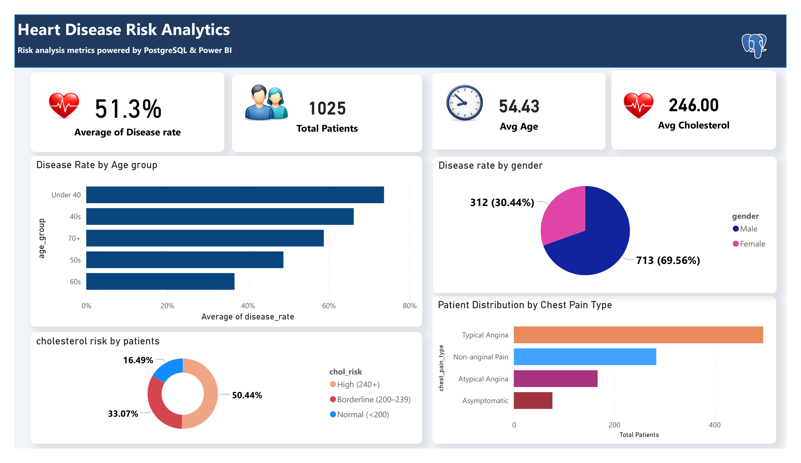

# Heart Disease Risk Analytics (PostgreSQL → Power BI)

A compact end‑to‑end analytics project that takes a heart disease dataset (`heart.csv`), loads it into **PostgreSQL**, builds reusable **SQL views**, and visualizes key risk insights in **Power BI**.



## Key SQL logic 

- **Disease rate** is computed as:
  - `AVG(target)` since `target` is 0/1
- **Gender labels**:
  - `sex = 1 → Male`, `sex = 0 → Female`
- **Age groups**:
  - Under 40, 40s, 50s, 60s, 70+
- **Chest pain mapping** (`cp`):
  - 0 Typical Angina
  - 1 Atypical Angina
  - 2 Non-anginal Pain
  - 3 Asymptomatic
- **Cholesterol risk buckets** (mg/dL):
  - Normal < 200
  - Borderline 200–239
  - High ≥ 240
 
  - ## SQL Example – Cholesterol Risk

```sql
SELECT
    CASE
        WHEN chol >= 240 THEN 'High (240+)'
        WHEN chol BETWEEN 200 AND 239 THEN 'Borderline (200–239)'
        ELSE 'Normal (<200)'
    END AS chol_risk
FROM public.heart_patient_data;
```

---

## Project goals

- Practice a realistic **BI workflow**: raw CSV → relational database → SQL views → Power BI report
- Build a clean set of **business-ready metrics** (disease rate, risk breakdowns, distributions)

---

## What’s in the dashboard

**Top KPIs**
- Overall disease rate
- Total patients
- Average age
- Average cholesterol

**Risk & distribution views**
- Disease rate by **age group**
- Disease rate by **gender**
- Patient distribution by **chest pain type**
- Cholesterol risk bucket distribution (Normal / Borderline / High)

---

## Data

- Source file: [`data/heart.csv`](data/heart.csv)  
- Target variable: `target` (1 = heart disease, 0 = no heart disease)

Columns included in the CSV:
`age, sex, cp, trestbps, chol, fbs, restecg, thalach, exang, oldpeak, slope, ca, thal, target`

---

## Methodology (PostgreSQL → Power BI)

### 1) Load CSV into PostgreSQL
Create a database (example: `heart_analytics`) and run the SQL script:

- [`sql/create_views.sql`](sql/create_views.sql)

That script:
1. Creates `public.heart_patient_data`
2. Loads the CSV (you run the `\copy` line)
3. Builds views used by Power BI:
   - `v_overall_kpi`
   - `v_age_risk`
   - `v_gender_risk`
   - `v_cp_risk`
   - `v_chol_risk`

### 2) Connect Power BI to Postgres
In **Power BI Desktop**:
- **Get Data → PostgreSQL database** (ODBC)
- Import the SQL **views** above
- Build visuals directly on the views (keeps Power BI modeling simple and clean)

---
## Repo structure

```
.
├── data/
│   └── heart.csv
├── images/
│   ├── dashboard.png
│   └── icons/
│       ├── icon_heart.png
│       ├── icon_people.png
│       ├── icon_clock.png
│       ├── icon_postgresql.png
│       └── icon_powerbi.png
├── reports/
│   └── heart_analytics.pdf
└── sql/
    └── create_views.sql
```

---

